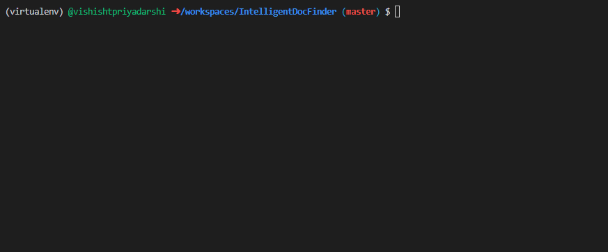
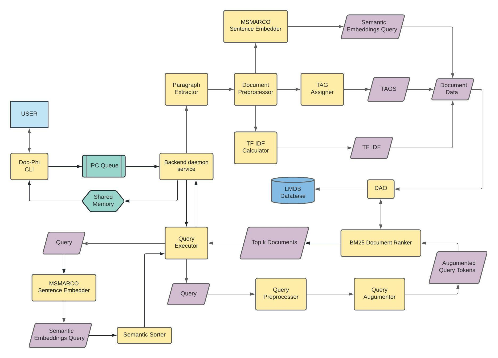
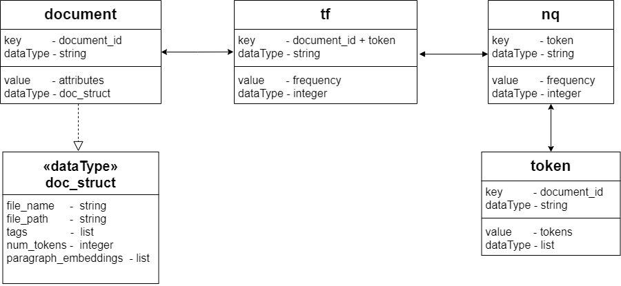

# Doc-Phi: Intelligent Document Finder

Doc-Phi is a Python based application written for efficient retrieval of documents in your device based on natural language queries. It currently supports the following operations.

- **Adding** documents to Doc-Phi
- **Querying** based on natural language to find the most relevant documents
- **Listing** manually and automatically assigned tags to a particular document

The application consists of a backend daemon service and a command line interface.




## Table of Contents
* [Installation](#installation)
    * [Docker Container](#docker-container)
    * [Manual Installation](#manual-installation)
    * [Dependencies](#dependencies)
* [Usage](#usage)
    * [Adding Documents](#1-adding-documents)
    * [Querying based on Natural Language](#2-querying-based-on-natural-language)
    * [Listing of the Tags](#3-listing-of-the-tags)
* [How Doc-Phi works](#how-doc-phi-works)
    * [Document Processing](#1-document-processing)
    * [Database Management System](#2-database-management-system)
        * [Schema](#schema)
        * [Data Access Object](#data-access-object-dao)
    * [Query Processing](#3-query-processing)
    * [Command Line Interface](#4-command-line-interface)
    * [Miscellaneous](#5-miscellaneous)
* [License](#license)

## Installation

#### Docker Container

A ready to use docker image, which consists of all dependencies pre-installed and starts with Doc-Phi backend daemon running, is available in the following link : https://hub.docker.com/r/aman18e/doc_phi

To use the application follow the given steps:-

1. Install docker engine on the local system by referring to https://docs.docker.com/get-docker/

2. Pull the image from docker hub using the command ` sudo docker pull aman18e/doc_phi `

3. Create a container from the pulled image using the following command:

   ```
   sudo docker run -v path_to_files:/home/data/ -it doc_phi
   ```

   Replace the variable `path_to_files` with the complete path of directory containing all document files .

   The running container can be stopped by using `exit` command. To restart use the command `sudo docker start container_name`
   

#### Manual Installation

Users can also manually install all dependencies and run the application using python natively installed in the local system/virtual environment by following steps:

1. Clone the repository from by `git clone https://github.com/ShivanshMishra18/IntelligentDocFinder.git`  

2. Run `cd IntelligentDocFinder`

3. Install python 3.8 & pip in the local system

4. Install pytorch by running`pip install torch==1.10.1+cpu -f https://download.pytorch.org/whl/cpu/torch_stable.html`

5. Run `pip install -r requirements.txt` to install remaining python dependencies. 

6. Create the backend daemon service from `docfinder.service` file :

   ````
   sudo cp docfinder.service /etc/systemd/systemd/docfinder.service
   sudo systemctl enable docfinder.service
   sudo systemctl start docfinder.service
   ````

7. Set up shortcut for CLI using the command given below:

   ````
   echo 'alias doc-phi="python3.8 /home/IntelligentDocFinder/cli/doc_phi.py"' >> ~/.bashrc
   ````

   The application can be now used by `doc-phi` command.

#### Dependencies

The major dependencies include:

* python 3.8
* pytorch 1.10.1 
* click 8.0.3
* huggingface-hub 0.2.1
* ipcqueue 0.9.7
* lmdb 1.2.1
* nltk 3.6.6
* numpy 1.21.5
* python-docx 0.8.11
* python-pptx 0.6.21
* scikit-learn 1.0.1
* sentence-transformers 2.1.0
* transformers .14.1
  


## Usage

The command line interface for the doc-phi can be used as:

```
Usage: doc-phi [OPTIONS] COMMAND [ARGS]...

Options:
  --help  Show this message and exit.

Commands:
  add     Add files to the database
  search  Search files using suitable query
  tags    Retrieve allotted tags for a file
```

Currently following operations can be performed:

### 1. Adding Documents

Various types of the documents can be added using the following syntax:

```
doc-phi add
```

After executing this command, various details pertaining to the document can be added using interactive interface.

### 2. Querying based on Natural Language

Most relevant documents can be queried upon using the following command:

```
doc-phi search -q <query>
```

The results will be displayed in the sorted order based on the rank of the document calculated using [Okapi BM25](https://en.m.wikipedia.org/wiki/Okapi_BM25) ranking function.

### 3. Listing of the Tags

The tags, both manual and automatic, assigned to a document can be viewed using the following command:

```
doc-phi tags -f <file_name>
```

## How Doc-Phi works

The querying backend for Doc-Phi is an amalgamation of conventional ranking algorithm, BM25, based on TF-IDF and contextual sentence level BERT model, MSMARCO. All neural models are implemented on the PyTorch backend. The indexes and documents' metadata is stored using the Lightening Memory-Mapped Database (LMDB). An ontology derived from the union of FIGER and TypeNet ontologies is used by Doc-Phi to automatically assign tags from a generic knowledge space.

### Data Flow Diagram


The following sections describe the details of various components of the application.

### 1. Document Processing

The core functionality of Doc-Phi is to efficiently process documents associated with the software to enable quick and efficient semantic document retrieval. The processing, as discussed above includes

<ol type='i'>
<li> word frequency based statistics used for filtering relevant documents
<li> neural transformer-based processing of paragraphs for contextual similarity matching
</ol>


Along with the processing required for querying, documents are also assigned tags which can are shown while querying. These tags are also assigned in this component.

This processing is achieved by the following logical steps:

#### a. Paragraphs Extractor

The processing operations within each document are performed at the granularity of a paragraph. Paragraphs extractor module lays out the interface and implements classes capable of reading documents and returning iterators over the paragraphs for various file types.

The module is thread safe, so as to be used along with our distributed pipeline. A factory for iterators is also provided.

#### b. Distributed Pipeline

All paragraphs go through various stages of transformations so that they can be used for filtering relevant documents during the first phase of querying. This involves natural language processing methods like *tokenizing, lemmatizing, removing stopwords and punctuations and stemming words*. 

This phase is implemented using a distributed multithreaded pipeline which, in essence, allows various portions of a document to be at different stages of the transformation at the same time while taking advantage of multiple cores of the machine. Each stage is allowed to have multiple workers. 

The pipeline uses iterators of a paragraphs extractor, a list of the various processing functions and an accumulator function providing a flexible use case. 

#### c. TF-IDF

TF-IDF stands for “Term Frequency — Inverse Document Frequency”, a technique to quantify words in a set of documents. A score is computed for each word to signify its importance in the document and corpus. 

Term Frequency, for a given word tells how many times it occurs in a particular document. Inverse Document Frequency measures the informativeness of a word. Given the words from a query, TF and TDF can together be used to find relevant documents. This was how search engines worked until a few years ago. However, we using this (with the BM25 algorithm) only to filter relevant documents.

#### d. Embeddings for Documents

For documents filtered out by BM25, Doc-Phi ranks the documents in order of relevance to the user query. This makes use of the sentence level BERT models which can encode paragraphs into real vectors. This can be achieved in either of the two ways:

- While processing a document, Doc-Phi (by default) uses [MSMARCO](https://www.sbert.net/docs/pretrained-models/msmarco-v3.html) to find and store embeddings for every paragraph in that document.
- By using the contextual word embeddings from BERT models and taking a weighted sum based on some parameter to aggregate them into sentence embeddings

**Note:** The choice of sticking to the paragraph level granularity is based on the heuristic that a paragraph talks about primarily one point at once. Document level embeddings on the hand, talk about the 'big picture' in general, while the sentence level embedding which are more informative would result in much higher storage and significant increase in search time while querying.

#### e. Tag Assignment

Although the CLI allows assigning manual tags for a document, the real power of Doc-Phi is automatic assignment of tags to documents. This is achieved by using the paragraph embeddings computed in the above step and finding the cosine similarity with the embeddings from a predefined set of tags.

We have defined our own ontology (tag set) for this purpose which is derived from the *FIGER* and the *TypeNet* knowledge hierarchies used for entity classification purposes.

### 2. Database Management System

Doc-Phi uses **LMDB** (Lightning Memory-Mapped Database) as its database. LMDB is a key-value pair database whose following functionalities motivated its use:

* Read transactions are extremely cheap.  
* Memory mapped, allowing for zero copy lookup and iteration.  
* No application-level caching is required: LMDB fully exploits the operating system’s buffer cache.

More about lmdb can be found at its [official documentation](https://lmdb.readthedocs.io/en/release/#).

### Schema



More about these data stores is as follows:

<ol type='a'>
  <li> <b>document</b><br>
  It contains the details about the documents that are added to the Doc-phi. The documents are identified by a unique identifier <a href="https://docs.python.org/3/library/uuid.html">uuid</a>. The values contain the attribute and its details in the form of dictionary.

  <br>
  <li> <b>tf</b><br>
  tf stands for the term-frequency and has its reference from the <a href="https://en.wikipedia.org/wiki/Tf%E2%80%93idf#Term_frequency_2">tf-idf</a>. The tf store contains the frequency of each of the tokens present in all the documents. The key for the tf store is obtained by concatenating the document id with the token itself (as string).

  <br>
  <li> <b>nq</b><br>
  The nq store keeps the track of the documents in which the token has appeared (at least once). It has its significance in the <a href="https://en.m.wikipedia.org/wiki/Okapi_BM25">Okapi BM25</a>. 

  <br>
  <li> <b>token</b><br>
  This data store tracks the list of tokens present in each document. The key is constituted by the document_id. 
</ol>


### Data Access Object (DAO)

Doc-Phi utilises DAO as an interface which provides the data operations without exposing the details of the database. As a result, there is no tight coupling between the database and the application logic, and a different database can be used without affecting the main application. 


### 3. Query Processing

Doc-Phi takes query in the form of natural language and returns a list of most relevant documents. This entire functionality is handled by the ```QueryEngine``` class and ```SemanticEmbedder``` module. The series of operations can be broken down into following functional unites:

<ol type='a' >
  <li> <b>Non-pipelined processing</b></li>
  The queries are first processed to convert it in the tokens. The process executes in a non-pipelined fashion since the size of queries won't be too large to be executed efficiently by the pipeline. The processing steps are similar to that of the <i>distributed pipeline</i> that we discussed before.
  <br>
  <br>
  <li> <b>Query Augmentation</b></li>
  The list of tokens retrieved after processing the query undergo an augmentation step. This step improves the search results by adding a variety of semantically similar tokens to the search space of the query. The augmentation process is carried out using the <a href="https://nlpaug.readthedocs.io/en/latest/"> nlapaug </a> module.

  <br>
  <br>
  <li> <b>2-level filtering</b></li>

   <br>
  <ol type='i'>
  <li> <b>Ranking Function</b></li>
  In the 1st level of filtering, <b>Okapi BM25</b> ranking function is used to select top k documents from the search space. Okapi BM25 makes use of the tf-idf on the <i>augmented query tokens</i> to filter out the documents using these query tokens. More details on the ranking function can be found on this <a href="https://en.m.wikipedia.org/wiki/Okapi_BM25"> wikipedia page</a>.
  <br>
  <br>
  <li> <b>Sentence Embeddings</b></li>
  Sentence embeddings are used to refine and fine-tune the search space by taking into account the semantic meaning of the queries. The ranking function doesn't take into the account the semantic proximity between the tokens and the documents. <br> Sentence embeddings can be calculated using 2 different methods - (i) MSMARCO Models, and (ii) BERT Models. <br>In our implementation, MSMARCO is expected to perform better than the BERT models since MSMARCO directly utilises transformers to calculate the sentence level embeddings. On the other hand for BERT model, first the word embeddings are found out which are then combined to form the sentence embeddings using suitable weights. More details on MSMARCO models can be found <a href="https://www.sbert.net/docs/pretrained-models/msmarco-v3.html"> here</a>. <br> 
     <br>

  On obtaining the sentence embeddings for the query, the cosine similarity is found between the documents obtained after level-1 filtering and the query. Thereafter the resultant documents are displayed in descending order of their relevance.
  </ol>
</ol>

### 4. Command Line Interface

The tool is made available as a client server program. The server is intended to be run as a daemon to provide service to possibly multiple clients. The client at present has a command line interface.

The server is associated with a message queue where all clients are allowed to write their requests along with their process identifier (PID). Message queue allows correctness of results as there is a single server. This condition is also demanded by LMDB.

The client is designed to sleep after placing a request. The server writes the response into a shared memory location which is known to the client as well. The server then raises an OS level signal to wake the client up.

### 5. Miscellaneous

To be completed...

Maybe include other details like design patterns

## License
